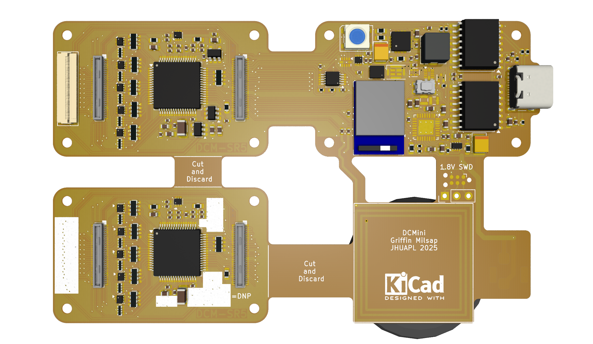

# DCMini — Miniaturized Biopotential Amplifier

© 2025 The Johns Hopkins University Applied Physics Laboratory LLC

DCMini is a **miniaturized biopotential amplifier and multi-sensor system** designed for research applications in **brain-computer interfaces (BCI)**, **muscular interfaces**, and **closed-loop biofeedback**. It combines a flexible set of sensors with powerful wireless telemetry and SD logging — in a package you can stick on your head.

> ⚠️ This hardware is for **research and development only**. It is **not certified** for medical use and **must not** be used for medical diagnostic purposes.

